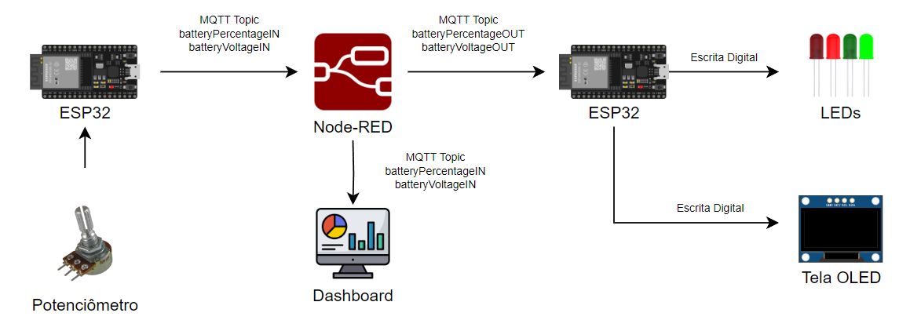

# EnergyTech - A TPC Solution

## Sumário
- [Integrantes;](#integrantes)
- [Descrição da Solução;](#descrição-da-solução)
- [Arquitetura da solução;](#arquitetura-da-solução)
- [Vídeo da solução;](#vídeo-da-solução)
- [Broker selecionado;](#broker-selecionado)
- [Configurações da aplicação;](#configurações-da-aplicação)
- [Link das placas.](#link-das-placas)

## Integrantes
- Beatriz Lucas - RM99104;
- Enzo Farias - RM98792;
- Ewerton Gonçalves - RM98571;
- Guilherme Tantulli - RM97890;
- Thiago Zupelli - RM99085.

## Descrição da Solução
A Energy Tech é uma plataforma em formato de marketplace, onde empresas, pequenos produtores e consumidores individuais podem comercializar energia renovável excedente, de forma segura e transparente.\
O sistema inclui um programa de doação de energia para comunidades carentes, incentivando os fornecedores a contribuírem para a inclusão social, além de receber benefícios fiscais adicionais ao promover acesso à energia limpa em áreas vulneráveis.\
O app combina tecnologias de IoT e blockchain para validar e registrar a energia gerada, armazenada e disponível para venda ou doação, assegurando que o marketplace opere com dados precisos e que as transações sejam seguras.

## Arquitetura da solução

## Vídeo da solução

## Broker selecionado
O Mosquitto é um broker de mensagens leve e de código aberto que implementa o protocolo MQTT, usado principalmente em Internet das Coisas (IoT). Ele facilita a comunicação entre dispositivos, permitindo que publiquem e assinem mensagens em um sistema de publicação/assinatura. O MQTT é ideal para dispositivos com baixo consumo de energia e redes de baixa largura de banda. O Mosquitto é escalável e eficiente, sendo usado em projetos de automação, monitoramento e redes IoT.

## Configurações da aplicação
As placas ESP32 estão sendo utilizadas pelo Wokwi. Dessa maneira, a configuração de conexão com a internet é feita com o seguinte código:\
**`const char* ssid = "Wokwi-GUEST";`**\
**`const char* password = "";`**\
\
Dessa forma, as placas (tanto a publisher como a subscriber) se conectam com a internet por meio do servidor do Wokwi. A placa responsável pela atuação como Publisher irá se conectar 
nos tópicos "batteryPercentageIN" e "batteryVoltageIN", de modo a enviar os dados simulados pelo potenciômetro, que serão recebidos pelo Node-RED, trabalhados para a criação de um Dashboard em "gauge" (medidor) referente
à porcentagem de bateria e volts simulados e serão enviados em novos tópicos, denominados de "batteryPercentageOUT" e "batteryVoltageOUT".
Essa configuração é feita a partir do seguinte código:\
\
(Conexão com o servidor do Mosquitto)\
**`const char* mqtt_server = "test.mosquitto.org";`**\
(Inscrição no tópico "batteryPercentageIN")\
**`const char* mqtt_topic_percentage = "batteryPercentageIN";`**\
(Inscrição no tópico "batteryVoltageIN")\
**`const char* mqtt_topic_voltage = "batteryVoltageIN";`**

A conexão com o servidor acontece com a configuação **`client.setServer(mqtt_server, 1883);`**, onde indicamos o servidor do Broker e a porta utilizada. Assim, as placas estão configuradas para a conexão com a internet e o compartilhamento de informações pelo servidor.\
\
**IMPORTANTE**: A partir desse ponto, é necessário que o Node-RED esteja rodando com o comando **`node-red`** no prompt de comando e dar deploy no fluxo, contido na pasta "NodeRED". Ele é responsável por enviar os dados para os tópicos que a segunda placa irá receber.\
\
A segunda placa, responsável por receber as informações e atuante como Reciever, é configurada de maneira similar à primeira, mas para receber as informações após serem coletadas e redistribuídas pelo Node-RED:\
\
(Conexão com o servidor do Mosquitto)\
**`const char* mqtt_server = "test.mosquitto.org";`**\
(Inscrição no tópico "batteryPercentageOUT")\
**`const char* mqtt_topic_percentage = "batteryPercentageOUT";`**\
(Inscrição no tópico "batteryVoltageOUT")\
**`const char* mqtt_topic_voltage = "batteryVoltageOUT";`**

A partir desse ponto, a segunda placa é configurada para exibir as informações recebidas de porcentagem e quantidade de volts em uma tela OLED, informando de maneira clara os dados coletados, além de coordenar dois LEDs, configurados para atuar da seguinte maneira:
- LED Verde: Dados de porcentagem igual ou maior que 90%;
- LED Vermelho: Dados de porcentagem abaixo de 90%.

Dessa forma, as placas conversam entre si, por meio da replicação de dados em outros tópicos pelo Node-RED, enviando e consumindo informações de porcentagem e quantidade de volts simulados de uma bateria, respondendo pelos LEDs a situação em que se encontra o potenciômetro e criando Dashboards no Node-RED.

## Link das placas
Publisher: https://wokwi.com/projects/414750098069787649 \
Subscriber: https://wokwi.com/projects/414858343779690497